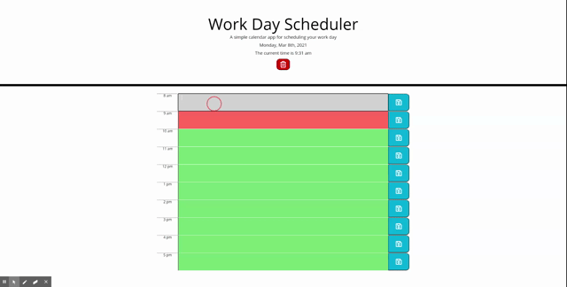

# Description - Work Day Scheduler

This is an application to store and retrieve activities by hourly blocks. This application utilizes HTML, CSS and JavaScript, as well as Moment.js in order to achieve its functionality and appearance. It also takes advantage of local storage to achieve persistence of planner events.

In addition to vanilla JS and CSS, this application:
* Utilizes jQuery syntax and code to streamline JavaScript
* Utilized Moment.js to get easier functionality with dates and times
* Takes advantage of Bootstrap for grid functionality with columns and rows

Challenges I encountered
* This project was a challenge in order to apply vanilla JavaScript fundamentals by using jQuery
    * Taking the functionality of JavaScript and applying it to the syntax of jQuery required heavy reliance on jQuery documentation 
* I initially began formatting and styling the time block elements utilizing tables, but ultimately I switched to using Bootstrap in order to get the items aligned properly and in an attractive form to maximize UX
* Getting persistance of the user data through local storage was also difficult, but after some input from other classmates I was able to establish unique ID attributes when creating elements within the DOM in order to organize the different elements so that their data could be stored and retrieved correctly
* I also spent a great deal of time searching for documentation and solutions for issues through Google, as well as using sites such as Stack Overflow, W3 Schools and others

*In the end, I have to thank my Instructor, TA, tutor and classmates for all their assistance. Even when I was providing input for others with the challenges they were facing, I began to think about new ways to address my own hurdles, so I owe a great deal of thanks and appreciation all around.*

## Credits
Many thanks to the below individuals who provided input and suggestions
* Mim Armand
* Stephen Simone
* Kat Poulos
* Matthew Goad
* Jay Yousef
* Ian Fletcher
* Stacy Brown
* And last, but not least - *Grogu*
        

If any additional issues are found, or if there are any suggestions for improvement, please send an email to site developer Chris Martinez at cbmartinez42@gmail.com

---

## <ins>Installation</ins>
1.  Clone or download .zip file from Github to your local computer
2.  Open index.html via your preferred browser or code/text editor

### <ins>Cloning</ins>
1. From Github, select the "Code" button, choose either HTTPS or SSH as appropriate
2. Click the copy button  to add it to your clipboard
3. In your preferred command line (terminal, bash, etc), navigate to the folder you'd like to download the repository into
4. Type `git clone [pasted url from clipboard]` and press enter
5. Access the content with your code editor by either typing `code .` in your command line or by using your editor's `File > Open Folder` in your code editor menu. If only viewing in a browser, simply double click index.html to open in your default browser

### <ins>Zip file</ins>
1. From Github, select the "Code" button, then select "Download ZIP"
2. Choose which folder to download the repository into via the dialog box that appears
3. After downloading, open the .zip file and select "Extract All" from the top of the window that appears
4. Access the content with your code editor by selecting `File > Open Folder` in your code editor menu. If only viewing in a browser, simply double click index.html to open in your default browser

[https://cbmartinez42.github.io/workday-planner/](https://cbmartinez42.github.io/workday-planner/)

---

These updates are covered under [GNU General Public License v3.0](./LICENSE)

## Screenshot below:

